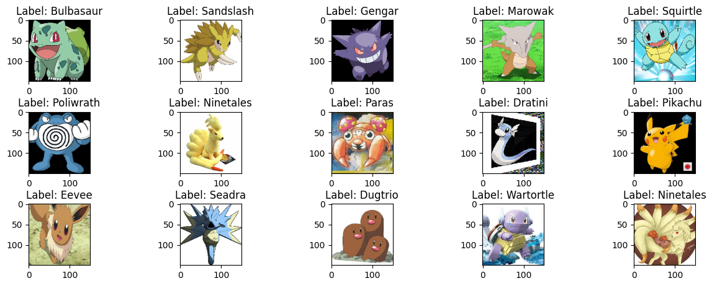
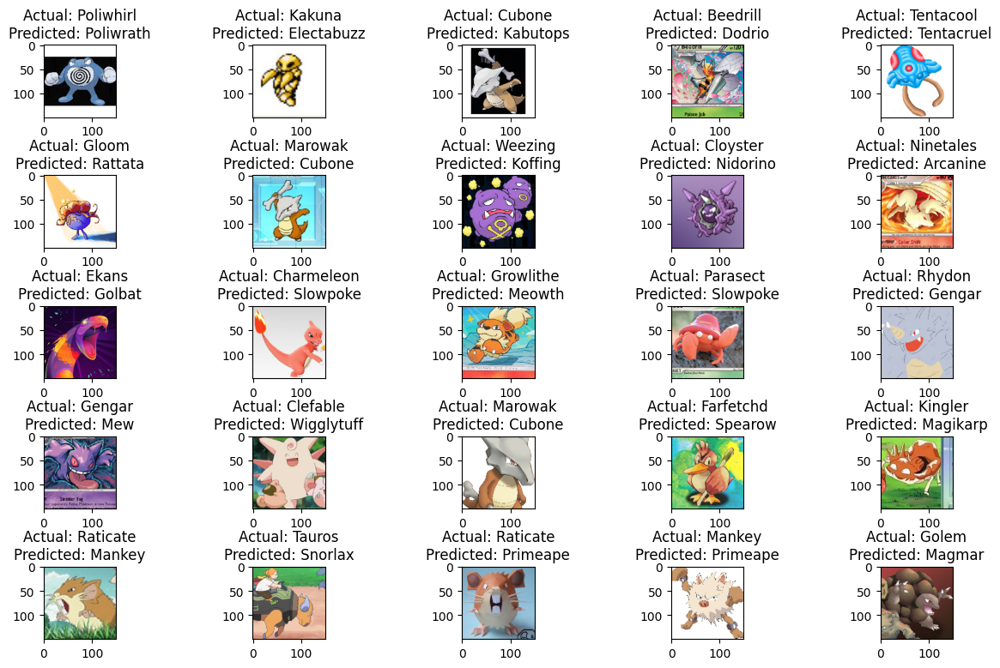
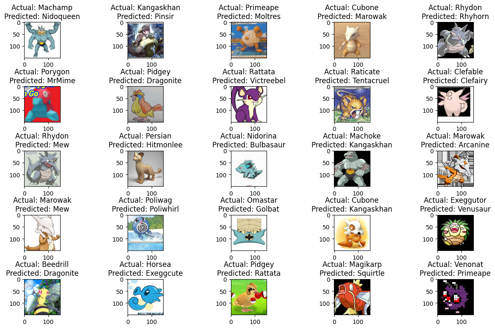

# Clasificación de imágenes usando Transfer Learning

Proyecto académico desarrollado durante la **Maestría en Ciencia de Datos** para explorar el uso de **Transfer Learning** en un problema de clasificación multiclase de imágenes.

El proyecto compara dos arquitecturas de redes neuronales convolucionales preentrenadas, **DenseNet201 y VGG16**, con el objetivo de identificar cuál ofrece un mejor desempeño al clasificar imágenes correspondientes a **150 clases de Pokémon**.

## Objetivo

Comparar el desempeño de **DenseNet201** y **VGG16** utilizando técnicas de transferencia de aprendizaje para determinar qué arquitectura se adapta mejor a un conjunto de imágenes con múltiples clases y una cantidad limitada de ejemplos por categoría.

---

# Conjunto de datos

El conjunto de datos contiene imágenes correspondientes a los **primeros 150 Pokémon**, con aproximadamente **25 a 50 imágenes por clase**.

  

Las imágenes provienen de distintas fuentes y estilos visuales, entre ellos:

* Anime.
* Videojuegos.
* Cartas.
* Dibujos.
* Fanarts.

Esta variedad genera un problema de clasificación interesante, ya que un mismo Pokémon puede aparecer con diferentes estilos, fondos, posiciones y características visuales.

---

## Problema de análisis

Entrenar una red neuronal profunda desde cero puede requerir grandes volúmenes de imágenes y una cantidad considerable de recursos computacionales.

Para este proyecto se utilizan modelos previamente entrenados y se busca explorar:

* ¿Es posible obtener buenos resultados utilizando **Transfer Learning**?
* ¿Qué arquitectura presenta un mejor desempeño para este conjunto de datos?
* ¿Qué diferencias existen entre los errores generados por DenseNet201 y VGG16?

---

## Flujo del proyecto

### 1. Preparación de imágenes

Las imágenes se redimensionan a **150 × 150 píxeles** y se preparan para ser utilizadas como entrada de los modelos.

También se aplican técnicas de **Data Augmentation** para generar variaciones de las imágenes disponibles y aumentar la diversidad del conjunto de entrenamiento.

### 2. Transfer Learning

Para evitar entrenar una red neuronal completamente desde cero, se utilizan modelos previamente entrenados sobre **ImageNet**.

Las arquitecturas evaluadas son:

* **DenseNet201**
* **VGG16**

El conocimiento aprendido previamente por estas redes se reutiliza y adapta al nuevo problema de clasificación.

### 3. Entrenamiento

Ambos modelos utilizan una configuración de entrenamiento basada en:

* Optimizador **Adam**.
* Función de pérdida **Categorical Crossentropy**.
* **Batch size de 32**.
* Hasta **10 epochs**.
* **EarlyStopping**.
* **ReduceLROnPlateau**.

La capa de salida se configura con **150 neuronas** y función de activación **Softmax**, correspondientes a las 150 clases del problema.

### 4. Evaluación

El desempeño de los modelos se compara utilizando métricas de clasificación:

* Precision.
* Recall.
* F1-Score.

También se analizan visualmente algunas de las clasificaciones incorrectas realizadas por cada arquitectura.

---

## Resultados

| Arquitectura | Precision | Recall | F1-Score |
|---|---:|---:|---:|
| **DenseNet201** | **0.87** | **0.86** | **0.86** |
| VGG16 | 0.68 | 0.63 | 0.63 |

**DenseNet201 obtuvo el mejor desempeño en todas las métricas evaluadas**, mostrando una diferencia considerable respecto a VGG16.

---

## Análisis de errores — DenseNet201

  

En DenseNet201 se observan algunas clasificaciones incorrectas entre Pokémon con características visuales similares o relacionadas.

Algunos ejemplos son:

* **Poliwhirl → Poliwrath**
* **Marowak → Cubone**
* **Weezing → Koffing**
* **Ninetales → Arcanine**

Este comportamiento sugiere que parte de los errores proviene de similitudes visuales entre determinadas clases.

---

## Análisis de errores — VGG16

  

VGG16 presenta una mayor cantidad de clasificaciones incorrectas y algunas de ellas muestran relaciones visuales menos evidentes entre la clase real y la predicción realizada.

Entre los ejemplos observados se encuentran:

* **Machamp → Nidoqueen**
* **Primeape → Moltres**
* **Rhydon → Mew**
* **Omastar → Golbat**
* **Beedrill → Dragonite**

En comparación con DenseNet201, las predicciones incorrectas de VGG16 muestran errores más variados y menos consistentes visualmente.

---

## Principales resultados

El análisis permitió observar que:

1. **DenseNet201 obtuvo mejores resultados que VGG16 en todas las métricas evaluadas.**
2. DenseNet201 alcanzó un **F1-Score de 0.86**, mientras que VGG16 obtuvo **0.63**.
3. Las clasificaciones incorrectas de DenseNet201 muestran con mayor frecuencia similitudes visuales entre las clases involucradas.
4. VGG16 presentó errores más variados y menos consistentes visualmente.

---

## Tecnologías utilizadas

* **Python**
* **TensorFlow**
* **Keras**
* **DenseNet201**
* **VGG16**
* **Transfer Learning**
* **Convolutional Neural Networks**
* **Scikit-learn**
* **NumPy**
* **Matplotlib**

---

## Autora

**Claudia Lissette Gutiérrez Díaz**

Proyecto desarrollado durante la **Maestría en Ciencia de Datos** en la Facultad de Ciencias Físico Matemáticas de la Universidad Autónoma de Nuevo León.