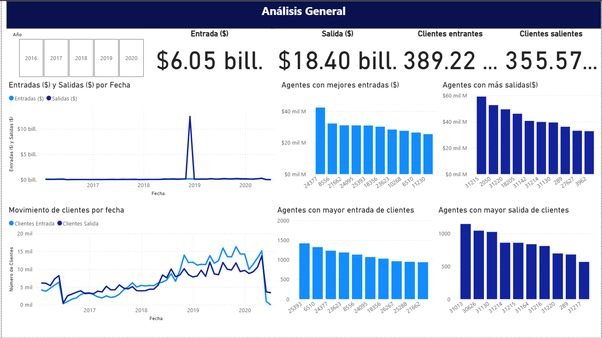
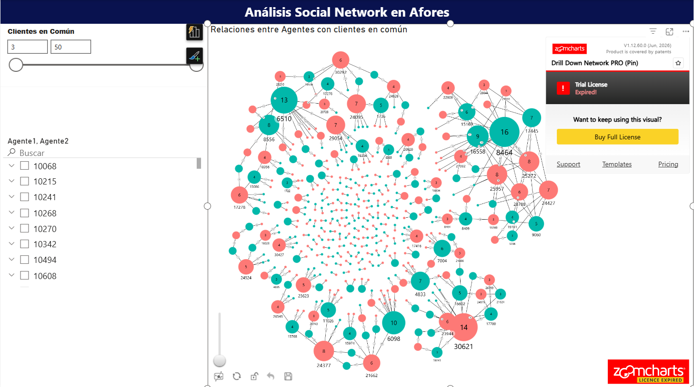
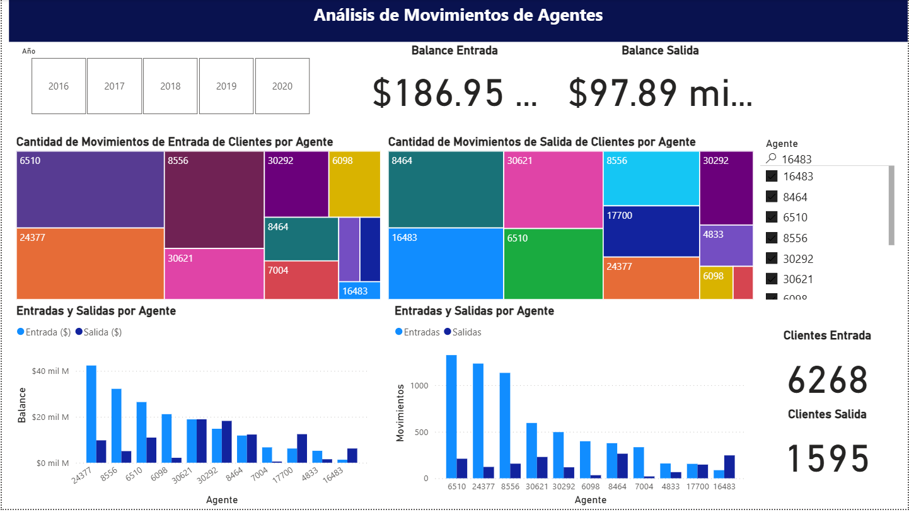

# Análisis de Redes Sociales aplicado a movimientos de clientes en Afores 🕸️

Proyecto académico desarrollado durante la **Maestría en Ciencia de Datos** para explorar el uso de **Social Network Analysis (SNA)** como herramienta para identificar patrones de relación entre agentes a partir de los movimientos de clientes en una Afore.

En lugar de analizar únicamente indicadores individuales, este proyecto modela las relaciones entre agentes mediante una red, permitiendo identificar comunidades, nodos centrales y agentes que actúan como puente entre distintos grupos.

## Objetivo

Construir una red de relaciones entre agentes utilizando clientes compartidos como vínculo, complementando el análisis con un dashboard en Power BI que integre indicadores tradicionales y métricas de la red.

---

# Dashboard

## Análisis General

<p align="center">
  
</p>

---

## Relación entre agentes

<p align="center">
  
</p>

---

## Análisis por agente

<p align="center">
  
</p>

---

## Problema de negocio

En una Afore es común analizar las entradas y salidas de clientes entre agentes.

Sin embargo, ciertos patrones pueden requerir una revisión más detallada. Por ejemplo, grupos de agentes que comparten clientes de forma recurrente podrían representar un comportamiento normal de operación o convertirse en un indicador de posibles traspasos indebidos.

Se busca responder:

- ¿Qué agentes mantienen mayor relación entre sí?
- ¿Qué agentes funcionan como puente entre distintos grupos?
- ¿Quiénes concentran la mayor cantidad de relaciones?

## Flujo del proyecto

### 1. Preparación de datos

El notebook `Social Network.ipynb` procesa el historial de movimientos de clientes.

Para cada cliente:

- Obtiene todos los agentes con los que tuvo interacción.
- Genera todas las combinaciones posibles utilizando `itertools.combinations`.
- Cuenta la cantidad de clientes compartidos por cada par de agentes.

El resultado es una tabla con la estructura:

| Agente 1 | Agente 2 | Clientes en común |
|----------|----------|------------------|

Esta tabla se exporta como:

```text
Relacion de Agentes.csv
```

y constituye el insumo principal para construir la red.

### 2. Construcción del grafo

A partir del archivo generado:

- Cada agente representa un nodo.
- Cada relación representa una arista.
- El peso de la arista corresponde a la cantidad de clientes compartidos.

El análisis de la red se realizó utilizando **NetworkX**.

### 3. Dashboard en Power BI

El dashboard integra indicadores tradicionales y análisis de redes, incluyendo:

- Balance de entradas y salidas.
- Movimientos de clientes por agente.
- Entradas y salidas monetarias.
- Agentes con mayor captación.
- Agentes con mayor pérdida.
- Visualización interactiva de la red.
- Filtro por número mínimo de clientes compartidos.

## Principales hallazgos

Durante el análisis fue posible identificar:

- Agentes con alta centralidad dentro de la red.
- Comunidades claramente definidas.
- Nodos puente entre comunidades.
- Diferencias entre el desempeño financiero y la posición estructural de un agente.

## Tecnologías utilizadas

- Python
- Pandas
- itertools
- NetworkX
- Power BI
- DAX
- Power Query

## Limitaciones

- Compartir clientes no implica necesariamente una práctica irregular; únicamente representa una relación que puede requerir un análisis adicional.
- El estudio depende de la calidad de los registros disponibles.
- Los resultados corresponden únicamente al conjunto de datos analizado.


## Autora

**Claudia Lissette Gutiérrez Díaz**

Proyecto desarrollado durante la **Maestría en Ciencia de Datos** en la Facultad de Ciencias Físico Matemáticas de la Universidad Autónoma de Nuevo León.
