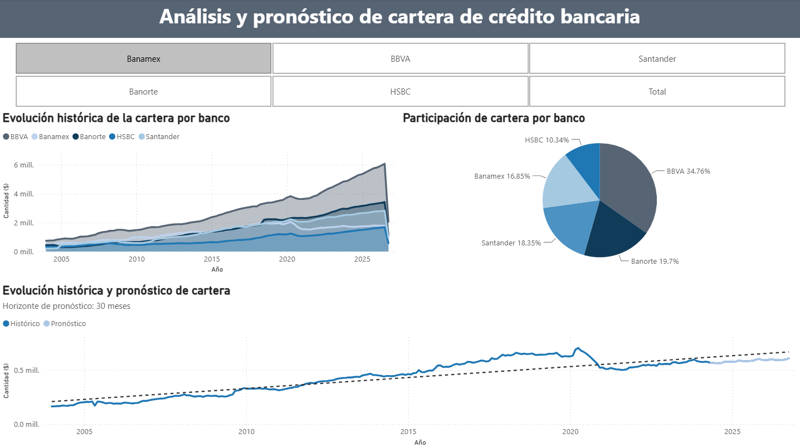
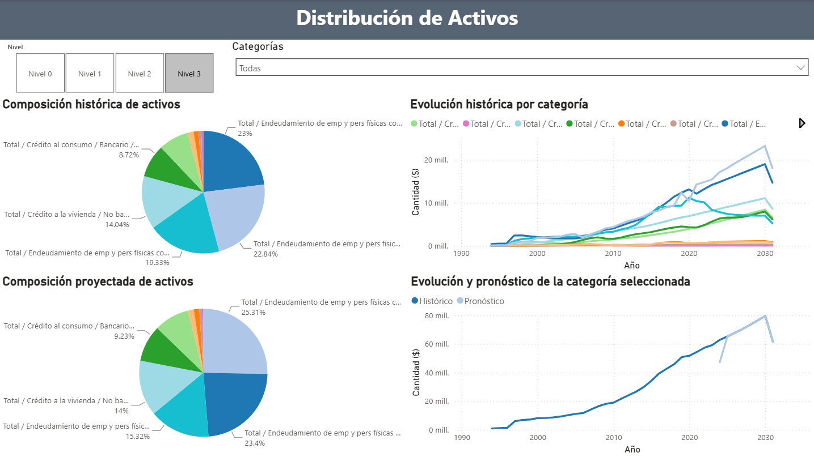

# Pronóstico de cartera de crédito con series de tiempo jerárquicas 📈

Proyecto académico desarrollado durante la **Maestría en Ciencia de Datos** para analizar la evolución de la cartera de crédito y activos del sector bancario mediante **series de tiempo, modelos ARIMA y pronósticos jerárquicos**.

El proyecto combina el modelado realizado en **R** con un dashboard en **Power BI**, permitiendo explorar tanto el comportamiento histórico como los valores pronosticados en distintos niveles de agregación.

## Objetivo

Analizar la evolución histórica de la cartera de crédito y los activos bancarios, generar pronósticos mediante modelos de series de tiempo y mantener la relación entre los diferentes niveles de la estructura jerárquica.

---

# Dashboard

## Cartera de crédito

<p align="center">
  
</p>

---

## Distribución de activos

<p align="center">
  
</p>

---

## Problema de análisis

Cuando diferentes series de tiempo forman parte de una misma estructura, analizarlas de manera independiente puede generar pronósticos que no mantengan relación entre los distintos niveles de agregación.

Por ejemplo, la cartera total puede estar compuesta por la cartera individual de distintas instituciones bancarias.

El proyecto busca analizar:

- ¿Cómo ha evolucionado la cartera de crédito de las instituciones analizadas?
- ¿Qué participación representa cada banco dentro de la cartera?
- ¿Cómo puede estimarse su comportamiento futuro?
- ¿Cómo mantener una estructura coherente entre los distintos niveles de información?
- ¿Cómo cambia la composición de los activos al analizar diferentes niveles de agregación?

## Flujo del proyecto

### 1. Preparación de datos

Los datos históricos son cargados desde archivos de Excel y posteriormente transformados en series de tiempo para su análisis en R.

Para la cartera de crédito se trabajó con información de:

- BBVA
- Santander
- Banorte
- Banamex
- HSBC

Las series fueron configuradas con periodicidad mensual a partir de 2004.

### 2. Modelado de series de tiempo

Para cada institución se generó un modelo **ARIMA** utilizando la función `auto.arima()` del paquete `forecast` de R.

A partir de los modelos se generó un horizonte de pronóstico de **30 meses**.

Los pronósticos individuales de los cinco bancos se almacenaron en una matriz correspondiente al nivel inferior de la jerarquía.

### 3. Estructura jerárquica

Las distintas series se relacionan mediante una matriz de agregación `S`, utilizada para representar la estructura existente entre los niveles inferiores y superiores.

De manera simplificada:

```text
BBVA ─────────┐
Santander ────┤
Banorte ──────┼──► Nivel agregado
Banamex ──────┤
HSBC ─────────┘
```

Los pronósticos del nivel inferior se integran mediante:

```r
Y = S %*% Y_lowest
```

permitiendo obtener los valores correspondientes a los diferentes niveles de la jerarquía.

### 4. Análisis de activos

El proyecto también incorpora un segundo conjunto de series correspondiente a diferentes categorías de activos.

Estas series se organizan en distintos niveles de agregación y son posteriormente utilizadas para analizar:

- Composición histórica.
- Composición proyectada.
- Evolución por categoría.
- Histórico y pronóstico de una categoría seleccionada.

### 5. Dashboard en Power BI

Los resultados obtenidos se integraron en Power BI mediante dos vistas principales.

#### Cartera de crédito

Incluye:

- Evolución histórica de la cartera por banco.
- Participación de cartera por institución.
- Selección individual de bancos.
- Comparación entre información histórica y pronosticada con horizonte de 30 meses.

#### Distribución de activos

Incluye:

- Navegación entre diferentes niveles de agregación.
- Composición histórica de activos.
- Composición proyectada.
- Evolución histórica por categoría.
- Comparación entre histórico y pronóstico.

## Principales resultados

El proyecto permitió:

- Analizar conjuntamente la evolución de distintas instituciones bancarias.
- Generar pronósticos individuales mediante modelos ARIMA.
- Representar las relaciones entre diferentes niveles mediante una estructura jerárquica.

## Tecnologías utilizadas

- R
- Power BI

## Autora

**Claudia Lissette Gutiérrez Díaz**

Proyecto desarrollado durante la **Maestría en Ciencia de Datos** en la Facultad de Ciencias Físico Matemáticas de la Universidad Autónoma de Nuevo León.