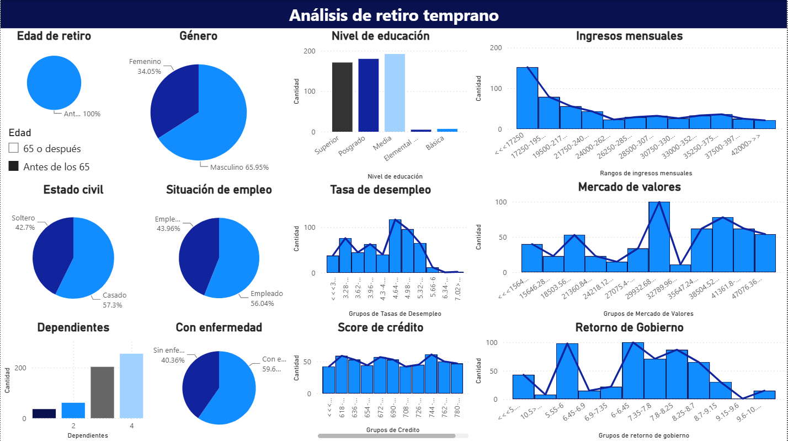
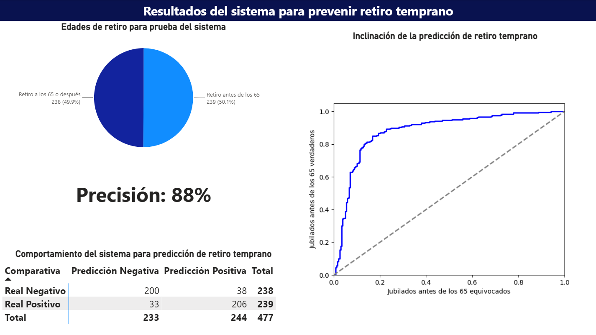

# Predicción de retiro temprano 📊

Proyecto académico desarrollado durante la **Maestría en Ciencia de Datos** para predecir si una persona podría retirarse **antes de los 65 años** a partir de variables personales, laborales, financieras y macroeconómicas.

El proyecto utiliza un modelo de **Regresión Logística** desarrollado en **Python** y complementa el análisis con un dashboard en **Power BI** para explorar el comportamiento de las variables y evaluar los resultados del modelo.

## Objetivo

Construir un modelo de clasificación que permita estimar la probabilidad de **retiro temprano** y analizar su desempeño como herramienta de apoyo para la planeación en contextos relacionados con seguros y planes de pensión.

---

# Dashboard

## Análisis de retiro temprano

<p align="center">
  
</p>

Esta vista permite explorar el comportamiento de las principales variables consideradas en el modelo, entre ellas:

* Género.
* Nivel educativo.
* Estado civil.
* Ingresos mensuales.
* Situación de empleo.
* Número de dependientes.
* Presencia de enfermedad.
* Tasa de desempleo.
* Mercado de valores.
* Score de crédito.
* Retorno de bonos gubernamentales.

---

## Resultados del sistema para prevenir retiro temprano

<p align="center">
  
</p>

La segunda vista presenta los resultados obtenidos en el conjunto de prueba mediante:

* Distribución de los casos reales.
* Matriz de confusión.
* Curva ROC.
* Comparación entre predicciones positivas y negativas.

---

## Problema de análisis

La decisión de retiro puede estar relacionada con diferentes características personales y condiciones económicas.

El proyecto busca responder:

* ¿Es posible clasificar si una persona se retirará antes de los 65 años?
* ¿Qué tan bien logra distinguir el modelo entre retiro temprano y retiro a los 65 años o después?
* ¿Puede un modelo predictivo apoyar la planeación en escenarios relacionados con pensiones y seguros?

---

## Flujo del proyecto

### 1. Preparación de datos

El conjunto de datos contiene **1,500 registros** y utiliza como variable objetivo:

* `1`: retiro antes de los 65 años.
* `0`: retiro a los 65 años o después.

Las variables predictoras incluyen información personal, laboral, financiera y macroeconómica.

### 2. Normalización

Las variables se estandarizan utilizando `StandardScaler` para llevarlas a una escala comparable antes del entrenamiento.

```python
scaler = StandardScaler()
X_scaled = scaler.fit_transform(X)
```

### 3. Balanceo de clases

Se utiliza **SMOTE (Synthetic Minority Over-sampling Technique)** para balancear las clases antes del entrenamiento del modelo.

```python
smote = SMOTE(random_state=42)
X_resampled, y_resampled = smote.fit_resample(X_scaled, y)
```

### 4. División entrenamiento / prueba

Los datos balanceados se dividen utilizando:

* **70 %** para entrenamiento.
* **30 %** para prueba.

La división se realiza de forma estratificada para mantener la proporción de las clases.

### 5. Regresión Logística

Se entrena un modelo de **Regresión Logística** y se utiliza `GridSearchCV` con validación cruzada estratificada de cinco particiones para seleccionar los hiperparámetros.

Los valores evaluados incluyen diferentes configuraciones de:

* Regularización `C`.
* Penalización `L1` y `L2`.
* Solver `liblinear`.

La mejor configuración obtenida en la ejecución almacenada en el notebook fue:

```text
C = 0.01
penalty = l2
solver = liblinear
```

---

## Evaluación del modelo

En el conjunto de prueba se obtuvieron los siguientes resultados:

| Métrica | Resultado |
| --- | ---: |
| Accuracy | **85.1 %** |
| ROC AUC | **0.885** |
| Precision - retiro temprano | **84 %** |
| Recall - retiro temprano | **86 %** |
| F1-score - retiro temprano | **85 %** |

### Matriz de confusión

|  | Predicción negativa | Predicción positiva |
| --- | ---: | ---: |
| **Real negativo** | 200 | 38 |
| **Real positivo** | 33 | 206 |

El modelo clasificó correctamente **406 de 477 observaciones** del conjunto de prueba.

La curva ROC obtuvo un **AUC aproximado de 0.885**, mostrando una buena capacidad para distinguir entre personas que se retiran antes de los 65 años y aquellas que lo hacen a los 65 años o después.

> **Nota:** en el dashboard de Power BI se muestra un valor de **88 %**. En el notebook, la métrica correspondiente al desempeño global es **Accuracy = 85.1 %**, mientras que el **ROC AUC = 0.885** (aproximadamente 88.5 %).

---

## Tecnologías utilizadas

* **Python**
* **Pandas**
* **Scikit-learn**
* **Imbalanced-learn / SMOTE**
* **Regresión Logística**
* **GridSearchCV**
* **Power BI**

---

## Autora

**Claudia Lissette Gutiérrez Díaz**

Proyecto desarrollado durante la **Maestría en Ciencia de Datos** en la Facultad de Ciencias Físico Matemáticas de la Universidad Autónoma de Nuevo León.
